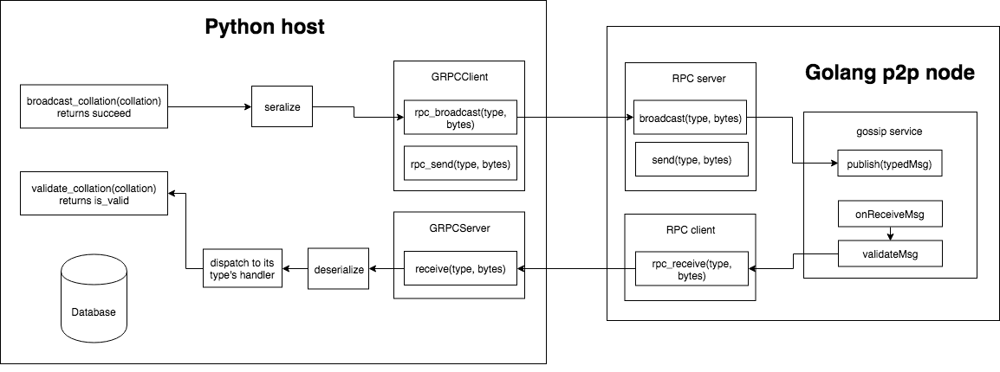

Guide to set up `GRPCServer` and `GRPCClient`
==================================

### Introduction
- `GRPCServer` is a wrapper of `EventServicer`, which handles RPC requests from the P2P layer. Currently, we only have a method `Receive` allowing P2P layer to send request and received content.

- `GRPCClient` is a wrapper of `PocStub`, which can be used to send RPC requests to the P2P layer. Currently, we have two methods in `GRPCClient`: `send` and `broadcast`. `send(peer_id, msg_type, data)` sends data to certain peers, while `broadcast(topic, msg_type, data)` broadcasts data to the peers subscribed to the `topic`.



To make the Python code work with the P2P layer in Go, we need to
- [Spin up the gRPC server in Python](#spinning-up-grpc-server)
- [Spin up the P2P node in Go](#spinning-up-the-p2p-node), which implies the gRPC server and client in Go are set up as well)

### Spinning up gRPC server
```
$ python grpc_server.py
```

The default listening address is `127.0.0.1:35566`. It can be configured in `config.py`


### Spinning up the P2P node

First, ensure `docker` is installed and under the `$PATH`.

Then, clone the [repo](https://github.com/ethresearch/sharding-p2p-poc)
```
$ git clone https://github.com/ethresearch/sharding-p2p-poc
```

Build the docker image
```
$ cd path/to/github.com/ethresearch/sharding-p2p-poc
$ docker build -t ethereum/sharding-p2p:grpc -f docker/dev.Dockerfile .
```

Run the docker container, with the `listenport`(default is `10000`) and `rpcport`(default is `13000`) published. Configuration can be changed when running `./sharding-p2p-poc`. Parameters and examples can be found [here](https://github.com/ethresearch/sharding-p2p-poc#example).
```
$ docker run -it -p 10000:10000 -p 13000:13000 ethereum/sharding-p2p:grpc sh -c "go build && ./sharding-p2p-poc"
```

The gRPC server with a P2P node should be ready now. You should be able to handle received P2P messages in `GRPCServer`, and send messages to the P2P node through `GRPCClient`.
